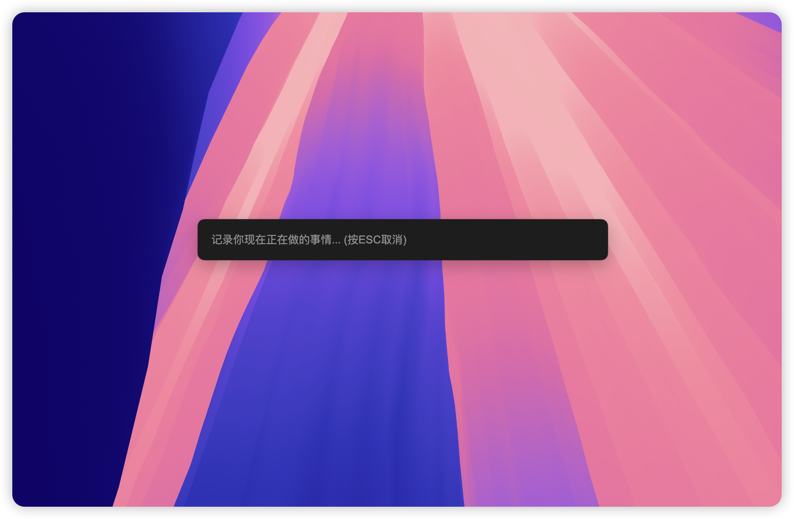
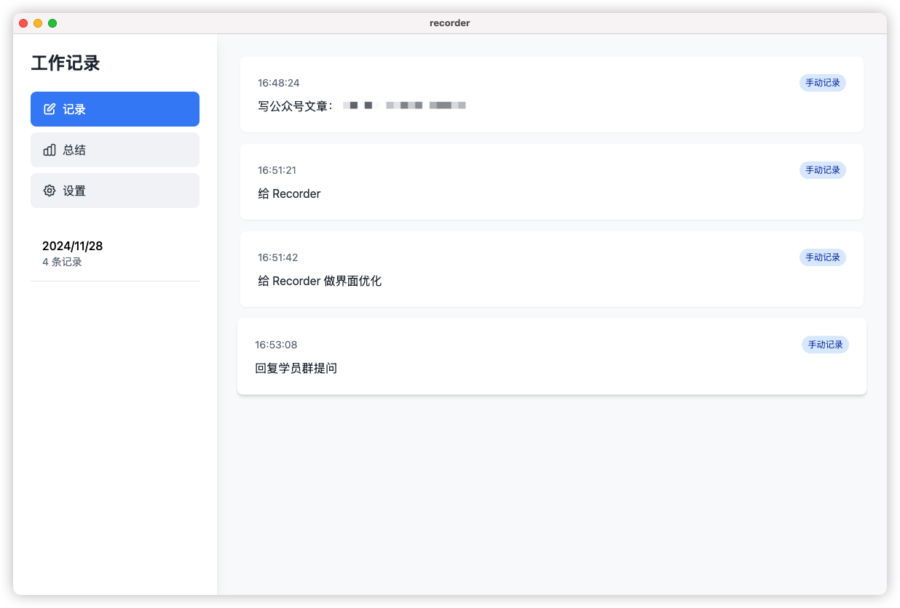
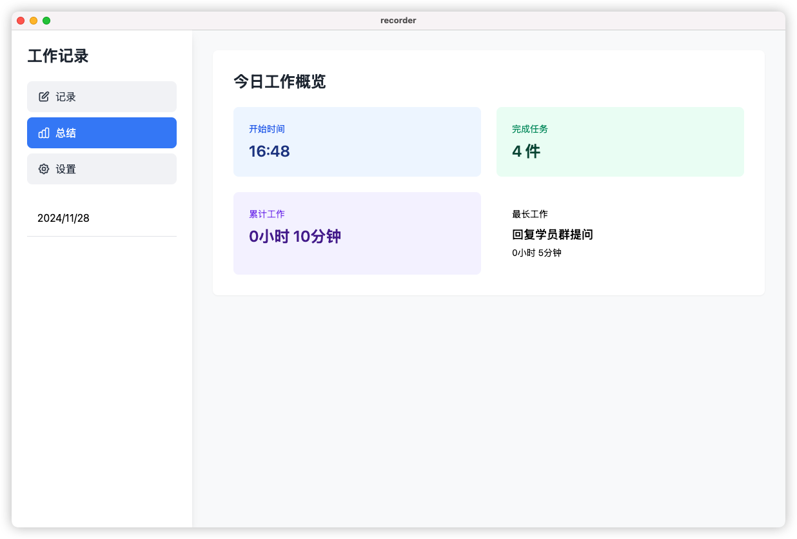
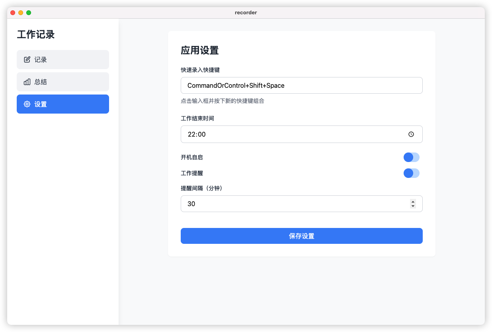

# Recorder
 随时唤起记录你在做什么，每天统计总结
 
 全程 Claude + Windsurf 编写，基于 electron 打包应用。

 应用描述提示词：[how-to-prompt](how-to-prompt.md)

## 预览

|||
|---|---|
|||

## 功能特点
  
- 使用快捷键快速记录工作内容
- 自动记录系统状态（待机/唤醒）
- 按天查看工作记录
- 自动生成每日工作总结
- 可配置的工作结束时间
- 支持开机自启动
  
## 打包应用

1. 安装依赖：

```bash
npm install
```

2. 运行开发版本：

```bash
npm start
```

3. 构建应用：
+ Mac 系统
```bash
npm run build:mac
```
+ Win 系统
  + 在 main.js 中修改快捷键设置：
    ```javasript
    // 将
    const shortcut = store.get('quickEntryShortcut', 'CommandOrControl+Shift+Space');
    // 改为
    const shortcut = store.get('quickEntryShortcut', process.platform === 'darwin' ? 'Command+Shift+Space' : 'Control+Shift+Space');
    ```
  + 运行：
  ```bash
  npm run build:win
  ```
## 使用说明

1. 默认快捷键 `Cmd+Shift+Space` 唤起快速录入窗口
2. 在设置中可以修改快捷键和工作结束时间
3. 每日工作总结会自动计算工作时长，并标识最长和最短工作项
